__推荐扩展__：

| 扩展名称 (Extension Name)                               | 主要功能简介
| :------------------------------------------------------ | :---------------------------------------- |
| __Dash to Panel__                                       | 将桌面活动概述和Dock合并为一个可高度自定义的面板
| __Compiz Alike Magic Lamp Effect__                      | 为窗口最小化等操作提供类似 Compiz 的魔灯动画效果
| __Blur my Shell__                                       | 为顶部栏、概述等界面添加毛玻璃模糊效果
| __Dash to Dock__                                        | 提供一个可自定义的 Dock 栏
| __gTile__                                               | 窗口平铺管理扩展
| __Auto Move Windows__                                   | 当应用程序创建窗口时，将它们移动到特定的工作区
| __GNOME Pomodoro__                                      | 番茄工作法计时器
| __AppIndicator and KStatusNotifierItem Support__        | 这个可以在 _Top Bar（顶栏）_ 显示后台应用图标
| __Coverflow Alt-Tab__                                   | 替代 Alt-Tab 功能，以封面流形式循环切换窗口
| __Clipboard Indicator__                                 | 剪贴板管理器
| __Burn My Windows__                                     | 分解你的窗户
| __Lock Keys__                                           | 数字键，大小写切换提示
| __TopHat__                                              | 可以在顶栏显示系统监控
| __Removable Drive Menu__                                | 用于访问和卸载可移动设备的状态菜单

### 扩展：Input Method Panel
描述：输入法面板使用KDE的kimpanel协议Gnome-Shell
URL：https://extensions.gnome.org/extension/261/kimpanel/

### 扩展：Edit Desktop Files
描述：通过右键单击其应用程序图标编辑 `.desktop` 文件。
URL：https://extensions.gnome.org/extension/7397/edit-desktop-files/

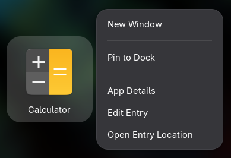

### 扩展：Auto Move Windows
描述：当应用程序创建窗口时，将它们移动到特定的工作区。

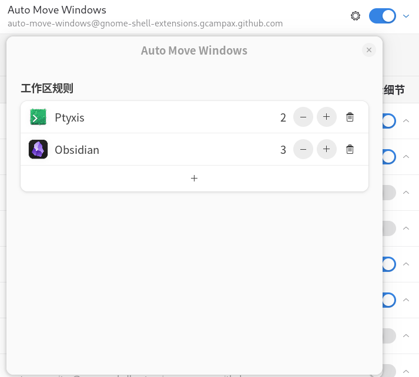

### 扩展：AppIndicator and KStatusNotifierItem Support
Extension ID: appindicatorsupport@rgcjonas.gmail.com
Supported: Yes
描述：这个可以在 _Top Bar（顶栏）_ 显示后台应用图标
URL：https://extensions.gnome.org/extension/615/appindicator-support/

### 扩展：Coverflow Alt-Tab
Extension ID: CoverflowAltTab@palatis.blogspot.com
Supported: Yes
描述：替代 Alt-Tab 功能，以封面流形式循环切换窗口。
URL：https://extensions.gnome.org/extension/97/coverflow-alt-tab/

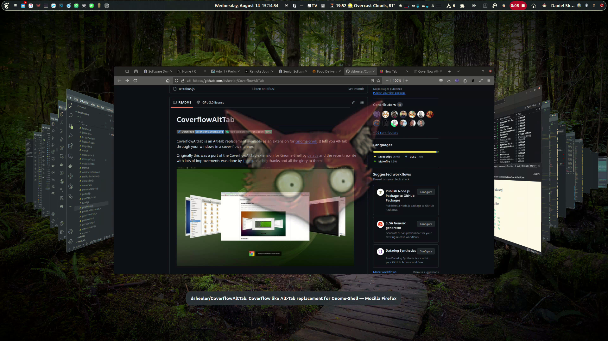

### 扩展：Compiz alike magic lamp effect
Extension ID: compiz-alike-magic-lamp-effect@hermes83.github.com
Supported: Yes
描述：神灯效果
URL：https://extensions.gnome.org/extension/3740/compiz-alike-magic-lamp-effect/

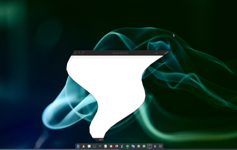

### 扩展：Dash to Dock
Extension ID: dash-to-dock@micxgx.gmail.com
Supported: Yes
描述：在你的 **工作区** 构建一个dock栏
URL：https://extensions.gnome.org/extension/307/dash-to-dock/

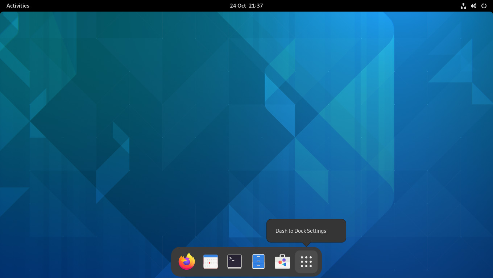

### 扩展：Blur my Shell
Extension ID: blur-my-shell@aunetx
Supported: Yes
描述：为GNOME Shell的不同部分添加模糊外观，包括顶部面板、破折号和概述。
URL：https://extensions.gnome.org/extension/3193/blur-my-shell/

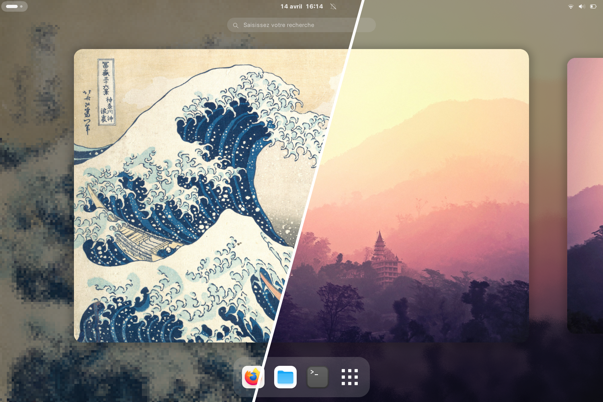

### 扩展：Clipboard Indicator
Extension ID: clipboard-indicator@tudmotu.com
Supported: Yes
描述：剪贴板管理器
URL：https://extensions.gnome.org/extension/779/clipboard-indicator/lg

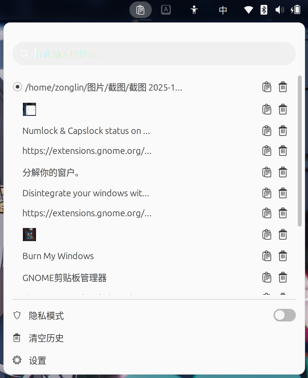

### 扩展：Burn My Windows
Extension ID: burn-my-windows@schneegans.github.com
Supported: Yes
描述：分解你的窗户。
URL：https://extensions.gnome.org/extension/4679/burn-my-windows/

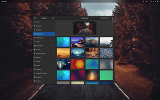

### 扩展：Lock Keys
Extension ID: lockkeys@vaina.lt
Supported: Yes
描述：数字键，大小写切换提示
URL：https://extensions.gnome.org/extension/36/lock-keys/

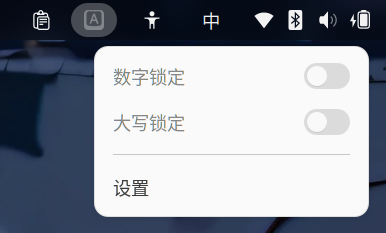

### 扩展：TopHat
Extension ID: tophat@fflewddur.github.io
Supported: Yes
描述：可以在顶栏显示系统监控，自定义度挺高的，可以改显示的数据类型等，还可以显示CPU每个核心的状态
URL：https://extensions.gnome.org/extension/5219/tophat/

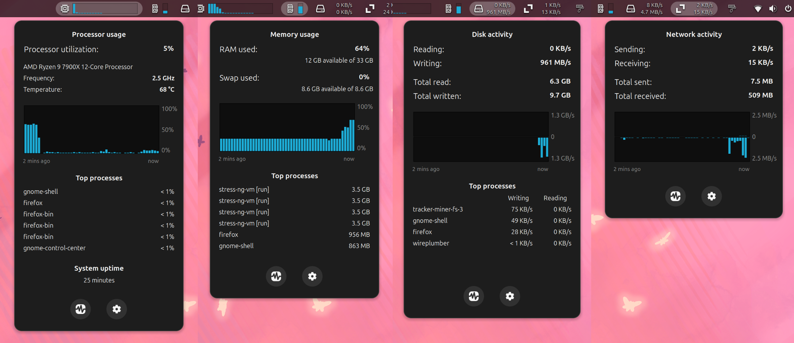

### 扩展：Removable Drive Menu
Extension ID: 
Supported: Yes
描述：用于访问和卸载可移动设备的状态菜单。
URL：https://extensions.gnome.org/extension/7/removable-drive-menu/

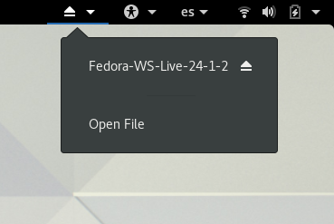
