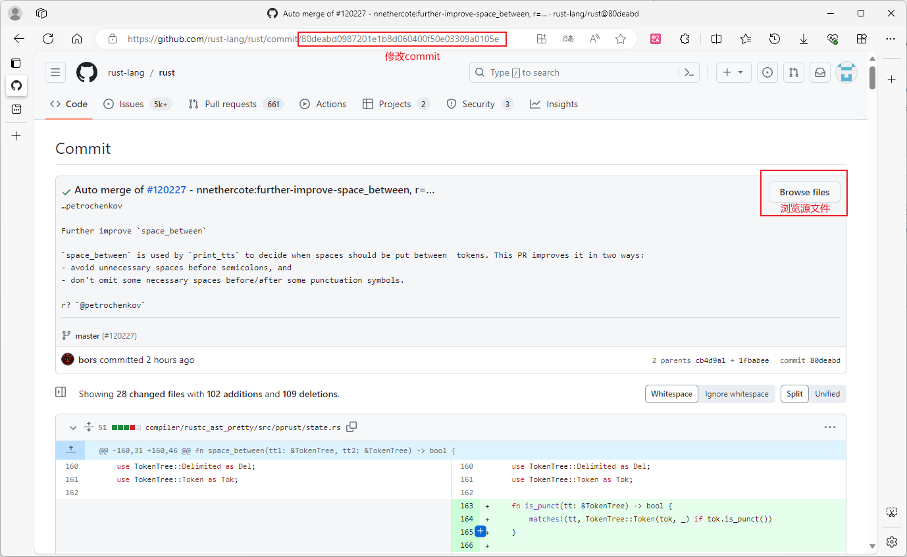
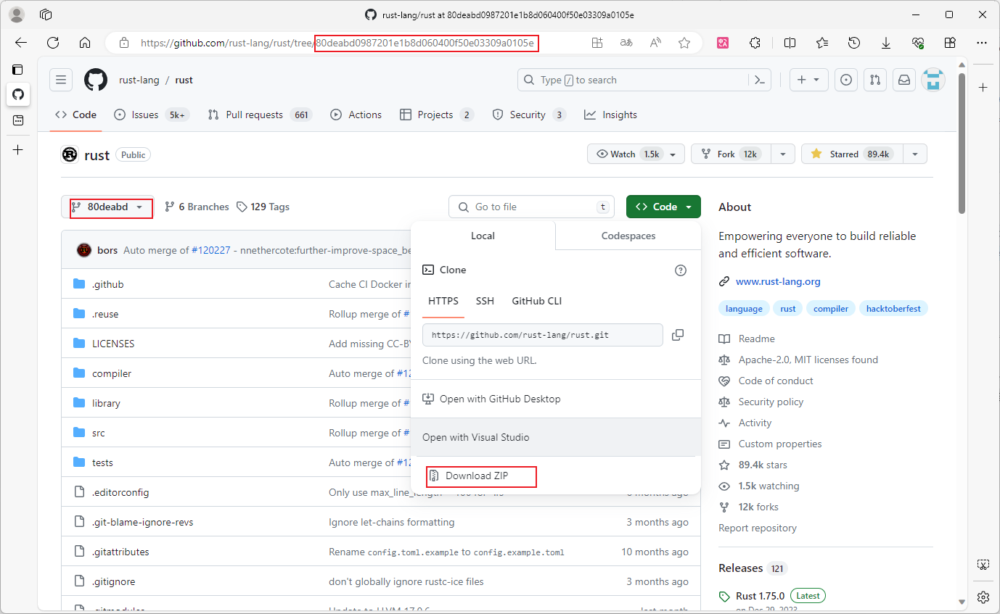

<pre>
commit 707d8c3f1bba10d5aaa9c8719c410711edf2e227
Merge: 31ffe48723d 465ffc9ca78
Author: bors <bors@rust-lang.org>
Date:   Fri Oct 27 04:06:40 2023 +0000

repo: https://github.com/rust-lang/rust/tree/master/src/doc/rustc
</pre>

Github 查询指定 commit 版本，从网页随便访问一个提交 

1. 修改 url 路径后的 commit
2. 点击右上角的 <kbd>Browse files</kbd>，这里你就可以看到原 commit 的所有文件
3. 如果你想下此版本的代码，使用 <kbd>Download ZIP</kbd>，默认 `git clone` 是 default 版 

Note: 如果你想知道官方更新了那些东西，可以把当前的版本创建一个 git，把最新版，扔进去，就可以查看到不同点了。