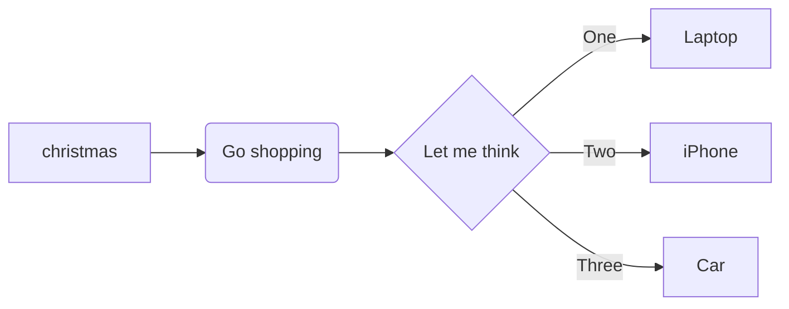
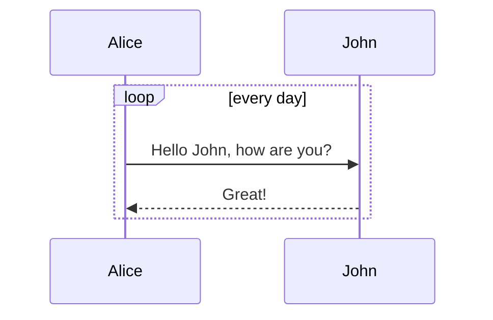
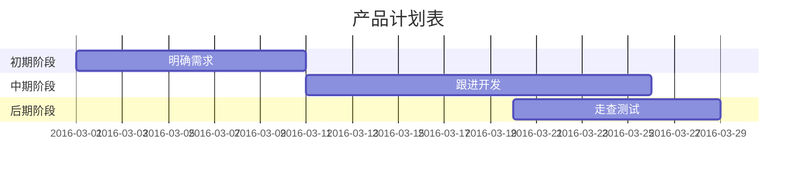

# Markdown 流程图

## 流程图

`graph LR（横向）|TD（纵向）;`

```mermaid
graph LR;

A[christmas] -->B(Go shopping)
B --> C{Let me think}
C -->|One| D[Laptop]
C -->|Two| E[iPhone]
C -->|Three|F[Car]
```

## 序列图

```mermaid
sequenceDiagram
loop every day
Alice->>John: Hello John, how are you?
John-->> Alice: Great!
end
```

## 甘特图

```mermaid
gantt
dateFormat YYYY-MM-DD
title 产品计划表
section 初期阶段
明确需求: 2016-03-01, 10d
section 中期阶段
跟进开发: 2016-03-11, 15d
section 后期阶段
走查测试: 2016-03-20, 9d
```
