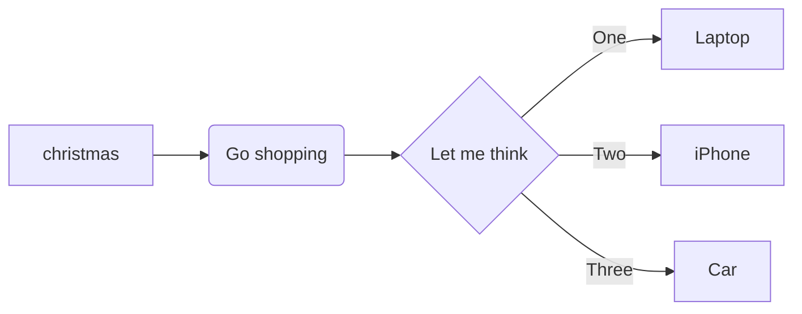
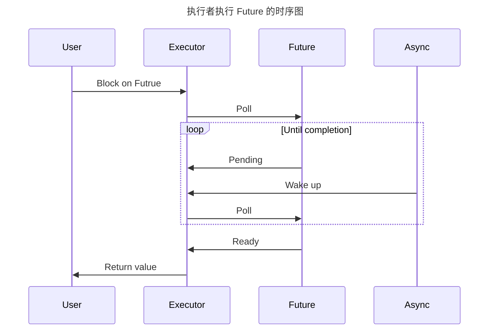
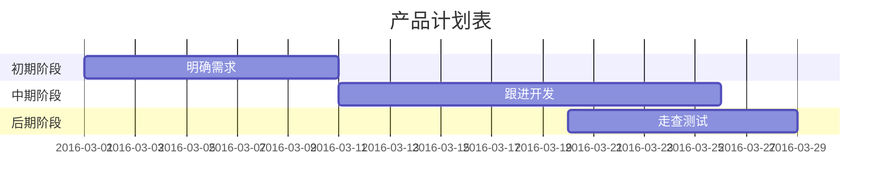
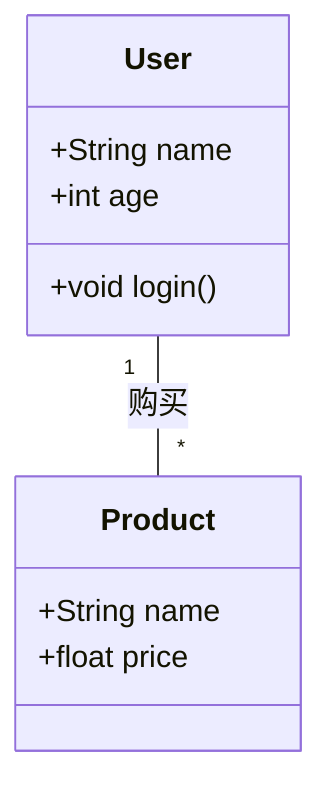

Markdown 本身并不直接支持流程图的绘制，但通过一些扩展语法和工具，如 **Mermaid** 和 **PlantUML**，可以在 Markdown 文件中嵌入流程图和其他图形。以下是两种常用的流程图工具及其支持的图表类型：

---

### **Mermaid**

Mermaid 是一种基于文本的图表工具，支持多种图表类型，语法简单，适合嵌入 Markdown 文件中。以下是 Mermaid 支持的图表类型：

#### 流程图

`graph LR（横向）|TD（纵向）;`

#### 序列图

#### 甘特图

#### **类图（Class Diagram）**

#### **状态图（State Diagram）**

