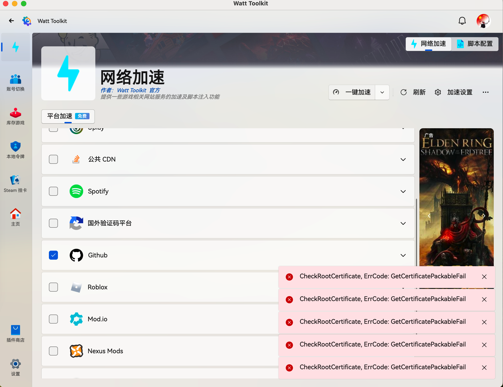

# 🐛GetCertificatePackableFail

## 描述

### 📷 复现步骤

今天打开后，点击一键加速，提示
"CheckRootCertificate，ErrorCode：GetCertificatePackableFail"

## Activity

__原因：__ 证书文件在用户目录下面找不到了, 我原来删除过这个软件的用户文件. 然后在安装证书时也是出这个错

__措施：__

- 加速设置中卸载证书重新安装
- 需要下最新的版本 rc11在10月10号后更新的版本
