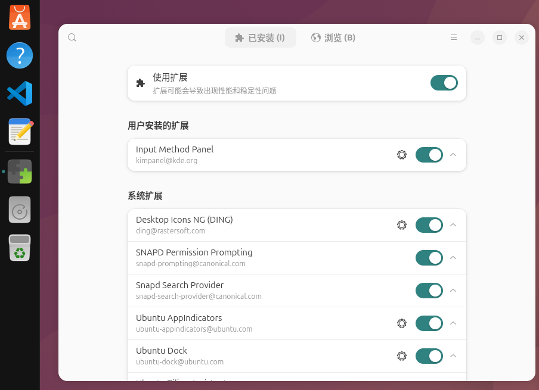
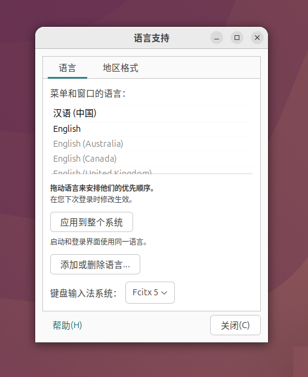

# Linux 下使用 IBus/Fcitx5 安装 Rime 与雾凇拼音

在 Ubuntu 26.06 上安装 Fcitx5 和 Rime，流程比之前讨论的 Android 端要直接得多，主
要通过 `apt` 包管理器完成。

### 📦 第一步：安装核心软件包

#### 安装 IBus + Rime + 雾凇拼音

```bash
sudo apt update
sudo apt install ibus ibus-rime git librime-plugin-lua

# 切换到 IBus
im-config -n ibus

# 安装雾凇拼音
mv ~/.config/ibus/rime ~/.config/ibus/rime.bak.$(date +%F-%H%M%S) 2>/dev/null
git clone --depth=1 https://github.com/iDvel/rime-ice.git ~/.config/ibus/rime

# 添加 Rime 输入法
ibus-setup
```

#### 安装 Fcitx5 + Rime + 雾凇拼音

```bash
sudo apt update
sudo apt install im-config
sudo apt install fcitx5 fcitx5-rime fcitx5-chinese-addons fcitx5-config-qt librime-plugin-lua

# 切换到 Fcitx5
im-config -n fcitx5

# 安装雾凇拼音
mv ~/.local/share/fcitx5/rime ~/.local/share/fcitx5/rime.bak.$(date +%F-%H%M%S) 2>/dev/null
git clone --depth=1 https://github.com/iDvel/rime-ice.git ~/.local/share/fcitx5/rime

# 添加 Rime 输入法
fcitx5-configtool
```

* **`fcitx5`**：输入法框架主程序。
* **`fcitx5-rime`**：Rime（中州韵）输入法引擎，这是你需要的核心。
* **`fcitx5-chinese-addons`**：中文增强组件，包含拼音助手等。
* **`fcitx5-config-qt`**：图形化配置工具。
* **`librime-plugin-lua`**：**建议安装**，否则雾凇拼音等方案的“日期/时间”等高级
  功能无法使用。

### ⚙️ 第二步：切换输入法框架并配置环境

Ubuntu 默认使用 IBus，需要将其切换到 Fcitx5，并正确设置环境变量。

1. **切换框架**：在终端执行 `im-config -n fcitx5`，然后**注销并重新登录**（或重
   启）使设置生效。
2. **配置环境变量**：编辑 `/etc/environment` 文件（需要 root 权限），添加以下内
   容以确保各类应用都能调用 Fcitx5：
   ```
   XMODIFIERS=@im=fcitx
   QT_IM_MODULE=fcitx
   ```
3. **Wayland 特别说明**：Ubuntu 26.04 默认使用 Wayland。**不要**全局设置
   `GTK_IM_MODULE=fcitx`，否则 GTK 应用的候选词窗口位置会错乱（“飘移”）。Wayland
   下应依赖其原生的 text-input-v3 协议。

### 🚀 第三步：在 Fcitx5 中添加 Rime

重新登录后，Fcitx5 应该已在后台运行。

1. 运行配置工具：`fcitx5-configtool`。
2. 在“输入法”选项卡中，点击“添加输入法”。
3. 取消勾选“仅显示当前语言”，搜索 **“中州韵”** 并添加它。
4. 将 Rime 移动到列表顶部，使其成为默认的中文输入法。

### ⚠️ 常见问题与解决

* **Fcitx5 无法开机自启**：在 Ubuntu（尤其是 GNOME）上，Fcitx5 有时不会自动启
  动。你可以手动创建一个自启动条目：

   ```bash
   mkdir -p ~/.config/autostart
   cat <<EOF > ~/.config/autostart/org.fcitx.Fcitx5.desktop
   [Desktop Entry]
   Name[ca]=Fcitx 5
   Name[da]=Fcitx 5
   Name[de]=Fcitx 5
   Name[fr]=Fcitx 5
   Name[ja]=Fcitx 5
   Name[ko]=Fcitx 5
   Name[ru]=Fcitx 5
   Name[vi]=Fcitx 5
   Name[zh_CN]=Fcitx 5
   Name[zh_TW]=Fcitx 5
   Name=Fcitx 5
   GenericName[ca]=Mètode d'entrada
   GenericName[da]=Inputmetode
   GenericName[de]=Eingabemethode
   GenericName[fr]=Méthode de saisie
   GenericName[ja]=入力メソッド
   GenericName[ka]=შეტანის მეთოდი
   GenericName[ko]=입력기
   GenericName[ru]=Метод ввода
   GenericName[vi]=Phương Thức Nhập
   GenericName[zh_CN]=输入法
   GenericName[zh_TW]=輸入法
   GenericName=Input Method
   Comment[ca]=Mètode d'entrada estàndard
   Comment[da]=Start inputmetode
   Comment[de]=Eingabemethode starten
   Comment[fr]=Lancer la méthode de saisie
   Comment[ja]=入力メソッドを開始
   Comment[ko]=입력기 시작
   Comment[ru]=Запустить метод ввода
   Comment[vi]=Kiểu Gõ Bắt Đầu
   Comment[zh_CN]=启动输入法
   Comment[zh_TW]=啟動輸入法
   Comment=Start Input Method
   Exec=/usr/bin/fcitx5
   Icon=fcitx
   Terminal=false
   Type=Application
   Categories=System;Utility;
   StartupNotify=false
   X-GNOME-AutoRestart=false
   X-GNOME-Autostart-Notify=false
   X-KDE-autostart-after=panel
   X-KDE-StartupNotify=false
   X-KDE-Wayland-VirtualKeyboard=true
   X-KDE-Wayland-Interfaces=org_kde_plasma_window_management
   EOF
   ```

* **部分应用无法输入中文**：检查环境变量是否已正确设置并生效。有时需要重启应用或
  整个会话。
* **候选词乱码**：通常是因为缺少合适的中文字体。可以安装 `fonts-noto-cjk` 或
  `fonts-wqy-zenhei` 来解决。

## Gnome Shell 扩展

### 安装扩展管理器和对应的插件

```
sudo apt update
sudo apt install gnome-shell-extension-manager
```

安装完成后打开，搜索`Input Method Panel`并安装，完成后如图所示：



### 系统设置

在`语言支持`中，将键盘输入法系统选为fcitx5，实现默认。



再次开机后将看到图示，如果不存在，可以手动点击选择启用即可。

